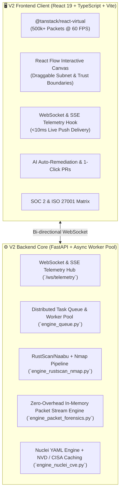

# 🛡️ Sentinel Enterprise Security Platform (v2.0)

> **High-Performance Cybersecurity Assessment, Real-Time Deep Packet Inspection (DPI) Forensic Suite, RustScan Pipelined Port Discovery, Nuclei YAML Engine, React Flow Topology, and Virtualized Packet Capture.**

---

## 🚀 Architectural Upgrades in v2.0



---

## 🛠️ Quick Start

### 1. Backend Service
```bash
cd V2/backend
pip install -r requirements.txt
python main.py
```
*API docs available at: `http://127.0.0.1:8000/docs`*

### 2. Frontend Application
```bash
cd V2/frontend
npm install
npm run dev
```
*Access UI at: `http://localhost:5174`*

---

## 🧪 Testing
```bash
# Run backend architecture test suite
python scratch/test_v2_suite.py

# Run frontend production build
cd V2/frontend
npm run build
```
